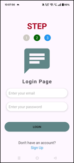
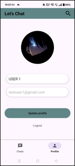
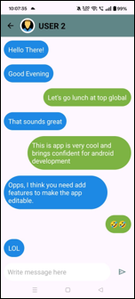

# Let's Chat

Let's Chat is a real-time Android messaging app built with Java and Firebase. Users can sign up, search for friends, and chat instantly with push notification support.

## Features
- User authentication with Firebase Email/Password  
- Real-time messaging using Firestore  
- Search for users by username  
- Profile setup with username and profile picture  
- Push notifications for new messages  

## Tech Stack
- Java  
- Firebase Firestore, Auth, Storage  
- Firebase Cloud Messaging (FCM)  
- Glide, ImagePicker, Firebase UI  

## Setup
1. Clone the repository:  
git clone https://github.com/HGabriel738/ChatApplication.git

2. Firebase setup:  
   - Create a Firebase project named `Let's Chat`  
   - Add an Android app with package name `com.example.letschat`  
   - Download `google-services.json` and put it in the `app/` folder  
   - Enable Authentication, Firestore, and Storage  
3. Open in Android Studio, sync Gradle, and run  

## Sample

## Project Structure
- `activities/` - UI screens  
- `adapters/` - RecyclerView adapters  
- `model/` - Data models  
- `utils/` - Helper classes
